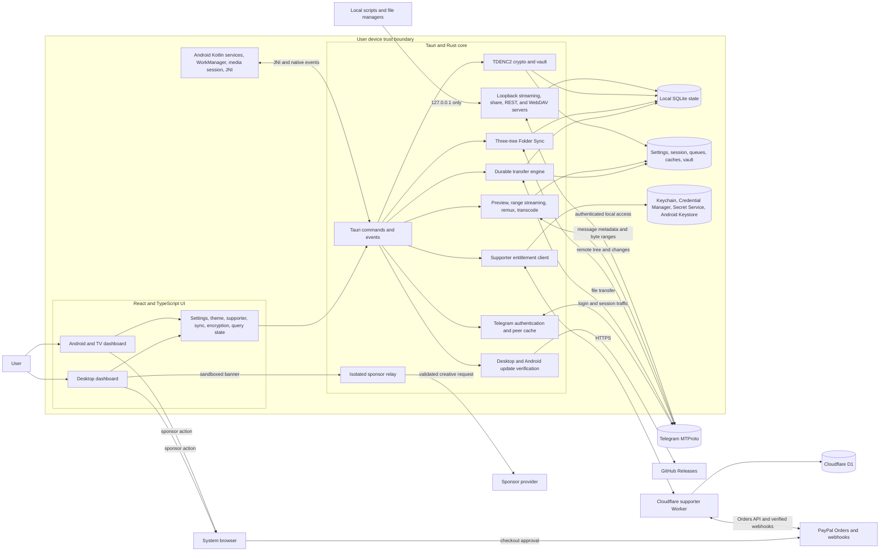

# Telegram Drive Application Audit and Improvement Report

**Audit date:** August 28, 2026
**Repository snapshot:** `77518a9` on `codex/architecture-remediation`
**Application version:** `3.7.0`
**Scope:** React/Tauri application, Rust native core, Android integration, local REST/WebDAV/streaming services, encryption, Folder Sync, supporter Worker, documentation, tests, and release automation.

## Executive summary

Telegram Drive is a substantial local-first application rather than a thin Telegram client. It combines a cross-platform file manager, durable transfer engine, media stack, three-way folder synchronization, optional client-side encryption, local integration servers, Android-native background services, and a separately deployed payment-verification service.

The project is strongest in defensive engineering. The code repeatedly favors fail-closed behavior, explicit limits, durable state, atomic publication, loopback binding, secret redaction, signed artifacts, migration checks, and recovery procedures. The automated suite is also broad and currently healthy.

The most important risks are not missing features. They are contract drift and complexity:

1. The checked-in supporter terms describe desktop-only entitlement, while the Worker serves same-version terms covering Windows, macOS, Linux, and Android, and the Android UI offers checkout. This must be resolved under the protected lifetime-license compatibility process without invalidating or narrowing existing purchases.
2. Settings Sync manually duplicates frontend settings contracts in Rust and currently rejects valid settings: nine supported locale codes are absent from its language allowlist, and the UI-supported `archiveMaxBytes: 0` value is outside the backend range.
3. Rare share-database errors write the raw share token to logs even though that token is a capability credential. Password verification also has no attempt throttling.
4. Several critical files are very large—up to 5,732 lines—so otherwise well-designed safety behavior is harder to reason about and change safely.
5. Localization and bundle-size checks pass as no-regression gates, but the remaining debt is material: 578 shipping UI literals are not extracted and several locale bundles still contain hundreds of English values.

No exploitable critical vulnerability was demonstrated during this repository review. This was not a penetration test, independent cryptographic audit, live Telegram exercise, live payment test, or production deployment review.

## Product assessment

### Core value proposition

Telegram Drive turns a user's Telegram Saved Messages and selected channels into a desktop-style file workspace. Its differentiator is the combination of direct Telegram connectivity with local-first organization and integrations:

- no separate Telegram Drive file relay;
- desktop, Android, and Google TV clients;
- durable uploads and downloads;
- media preview, playback, remuxing, and transcoding;
- bidirectional desktop Folder Sync;
- opt-in TDENC2 client-side encryption;
- loopback REST API, WebDAV, and local share links;
- optional, one-time $5 lifetime ad-free supporter entitlement;
- 24 selectable locales and RTL support.

### Likely user groups

| User group | Primary need | Current fit |
| --- | --- | --- |
| Personal archive users | Organize files already stored in Telegram | Strong |
| Media-heavy users | Preview and stream Telegram-hosted media | Strong, with codec/FFmpeg caveats |
| Desktop power users | Sync folders, mount WebDAV, automate with REST | Strong but operationally complex |
| Privacy-conscious users | Local state, no file relay, optional encryption | Strong design intent; independent encryption audit still needed |
| Android/TV users | Browse, transfer, and play media with native controls | Broad feature set; separate preview/release path adds friction |
| Automation users | Script file and folder operations locally | Good endpoint breadth; contract and integration testing can improve |

### Product positioning risk

The main README now uses the accurate phrase “local-first file workspace powered by your own Telegram account” and explicitly rejects a literal “unlimited storage” interpretation. Some application and package copy still says “unlimited, secure cloud storage” or “self-hosted secure storage.” Those stronger claims are difficult to reconcile with Telegram service limits, standard plaintext uploads, and an encryption feature explicitly labeled alpha and unaudited. Product language should consistently describe what is guaranteed and what is optional.

## System architecture

### Architectural interpretation

- The primary data plane is device-to-Telegram. The supporter Worker is an entitlement service, not a file service.
- The WebView is intentionally kept behind a native command boundary. Network-heavy, filesystem, cryptographic, database, and lifecycle work is primarily implemented in Rust.
- Local integration servers are separate Actix services. REST and WebDAV are restartable and disabled by default; the media/share server starts with the app and binds to loopback.
- SQLite is the durable coordination layer for shares, metadata, encryption registry records, file inventory, sync state, and transfer state. Application settings and some queue/cache state also use application files or Tauri stores.
- Android adds a second native layer for foreground transfers, recovery jobs, OS media controls, update installation, secure storage, and share-sheet intake.

## Component inventory

| Area | Main implementation | Responsibilities | Assessment |
| --- | --- | --- | --- |
| App shell | [`app/src/App.tsx`](app/src/App.tsx), [`AppProviders.tsx`](app/src/components/shared/AppProviders.tsx) | Startup health, session restore, platform routing, providers, update/crash UI | Clear ownership and lazy top-level platform split |
| Desktop UI | [`DesktopDashboard.tsx`](app/src/components/desktop/DesktopDashboard.tsx), `components/desktop/dashboard/` | File explorer, selection, drag/drop, previews, settings, transfer center | Feature-rich; orchestration component is too large |
| Mobile/TV UI | [`MobileDashboard.tsx`](app/src/components/mobile/MobileDashboard.tsx), `components/mobile/` | Touch/remote navigation, transfers, settings, playback, supporter flow | Broad scope concentrated in one component |
| Frontend state | `context/`, `hooks/`, `services/` | Settings, query cache, sync, supporter, encryption, transfer policies | Good separation is emerging; native contracts remain stringly typed |
| Native bootstrap | [`app/src-tauri/src/lib.rs`](app/src-tauri/src/lib.rs) | Plugin setup, managed state, servers, background services, commands, shutdown | Robust lifecycle handling; oversized composition root |
| Telegram operations | `commands/auth.rs`, `commands/fs.rs`, `commands/preview.rs` | Login, files, folders, URL upload, download, search, previews | Extensive hardening; very high file-level complexity |
| Durable transfers | [`transfer_engine.rs`](app/src-tauri/src/transfer_engine.rs) | Queue persistence, scheduling, state transitions, restart recovery | Strong reliability model and tests |
| Folder Sync | [`sync_engine/`](app/src-tauri/src/sync_engine) | Watcher, planner, executor, conflicts, deletion guards | One of the best-factored native domains |
| Encryption | [`crypto/`](app/src-tauri/src/crypto), [`crypto_commands.rs`](app/src-tauri/src/crypto_commands.rs) | Vault, key slots, envelopes, authenticated streaming, recovery | Defensive design; alpha status and no independent audit |
| Media | `server.rs`, `transcode.rs`, `fmp4_remux.rs`, frontend media hooks/players | Range streaming, HLS, MP4 repair, FFmpeg, PDF/audio/video | Capable but bundle- and code-heavy |
| Local integrations | `api_routes.rs`, `webdav.rs`, `share_routes.rs` | REST, WebDAV, password links | Good loopback defaults and credential hashing; throttling/log hygiene gaps |
| Local data | `db.rs`, `db_migrations.rs` | Schema checks, migration ledger, backups, serialized DB access | Strong migration safety; one shared SQLite mutex can become a throughput limit |
| Android native | `app/android-overrides/` | Foreground service, recovery worker, playback service, activity bridge | Considerable platform investment with CI emulator coverage |
| Supporter service | [`supporter-service/src/`](supporter-service/src) | PayPal verification, signed entitlement, recovery, device limit, webhook handling | Strong invariants and tests; terms sources are inconsistent |
| Delivery | [`.github/workflows/`](.github/workflows), `app/scripts/` | Desktop release, Android verification, visual tests, Worker deploy, D1 backup | Strong fail-closed checks; Android remains a separate manual/callable workflow |

## Key runtime flows

### Startup and authentication

1. The React shell checks native startup health.
2. It reads the saved API ID from `config.json` and asks Rust to initialize the Grammers client.
3. Rust opens the local Telegram session database, configures proxy/DC behavior, starts a single network runner, and validates the saved session with Telegram.
4. New users enter their own Telegram API ID/hash and authenticate through QR, phone code, and optional Telegram cloud password paths.
5. Desktop and mobile dashboards load only after authentication succeeds.

Strengths include explicit runner shutdown, phone-number validation/redaction, QR-first desktop login, cooldown handling, and mobile reauthentication paths. At-rest Telegram API/session protection still relies mainly on the operating system's protection of the application data directory rather than the dedicated credential-store abstraction used for proxy and supporter secrets.

### File browsing and transfer

- Telegram messages are normalized into file metadata and cached in a versioned local inventory.
- The UI shows cached rows quickly, then reconciles with Telegram using request sequence IDs so stale responses cannot overwrite newer state.
- Desktop transfers are native, durable, concurrency-limited jobs with explicit pause, retry, cancel, network-wait, flood-wait, and vault-unlock states.
- Downloads use private temporary files, verify expected size, sync the file, and publish atomically.
- Android adds staged share-sheet intake, foreground services, WorkManager recovery, low-storage policy, and native publication.
- Remote URL upload performs public-address and redirect validation to reduce SSRF risk.

### Media and preview

- The app uses bounded thumbnail and preview caches.
- Plaintext media can be served over a session-token-protected loopback endpoint with byte ranges.
- MP4 can be remuxed and unsupported media transcoded through FFmpeg into HLS variants.
- Version 3.7 adds session-scoped credentials and authenticated chunk decryption for supported TDENC2 video, audio, and PDF streaming while the vault is unlocked.
- Android hands supported streams to a native media activity/service for system controls, resume, tracks, playback speed, PiP, and TV behavior.

The current README limitation list has not caught up with this protected media support.

### Folder Sync

Folder Sync compares local, remote, and last-synced trees. It aborts incomplete remote scans, reports conflicts instead of overwriting simultaneous edits, blocks plans that would delete more than half of the baseline, rejects nested mappings and duplicate remote paths, and publishes downloads atomically. This is a sound safety model for a destructive synchronization feature.

### Encryption

TDENC2 uses streaming XChaCha20-Poly1305 envelopes, Argon2-derived passphrase keys, authenticated metadata, vault and per-file key slots, zeroization-oriented secret wrappers, recovery bundles, session-scoped operation credentials, and automatic vault locking. Encrypted operations generally fail closed when the app cannot safely supply plaintext.

The design deserves credit for explicit recovery drills and for not presenting alpha cryptography as recoverable. It still needs an independent protocol and implementation audit before the product treats it as a high-assurance security boundary.

### Local REST, WebDAV, and share links

- REST and WebDAV are desktop-only, disabled by default, bind to loopback, and store only hashes of high-entropy credentials.
- WebDAV defaults to read-only and stages writes before Telegram upload.
- Local share links use a random 128-bit token and optional bcrypt password protection.
- Encrypted objects fail closed across unsupported local integration operations.

The loopback boundary should be communicated more precisely: a `127.0.0.1` share link works on the same computer, not directly on another device. Password verification also needs bounded attempt handling, and capability values must never enter logs.

### Supporter entitlement

1. The app creates a device key and accepts the current terms.
2. The Worker creates and verifies an exact `$5.00 USD` PayPal order.
3. After verified capture, the Worker issues an Ed25519-signed, device-bound entitlement and a recovery code.
4. The app stores private material in the platform credential manager or Android Keystore and caches the signed token locally.
5. Refresh detects refunds, reversals, chargebacks, or upheld disputes; active and offline-grace states remain ad-free.
6. D1 backups are deliberately independent from checkout and entitlement availability.

This flow is well defended, but its contractual documentation must be made single-source and internally consistent before further Android supporter expansion.

## Data, storage, and trust boundaries

| Data | Local storage | External destination | Notes |
| --- | --- | --- | --- |
| Telegram API ID/hash | Tauri store | Telegram during client authentication | API hash is locally persisted; treat as a secret |
| Telegram authorization session | Local Grammers SQLite session | Telegram | Loss revokes local convenience, not remote files |
| File bytes | Temp/cache/destination as needed | Telegram | Standard uploads are plaintext to Telegram; TDENC2 uploads are ciphertext |
| File inventory and activity | Local SQLite | None beyond Telegram reconciliation | Enables fast local-first rendering |
| Transfer queue | Local durable store/SQLite | Telegram during work | Recovers across process and window restarts |
| Folder Sync state | Local SQLite and mapped folders | Telegram channel | Three-tree reconciliation and conflict records |
| Vault material | Encrypted local vault | No server; recovery bundle only when user exports it | Passphrase loss can be permanent |
| Proxy password | OS credential manager | Configured proxy during connection | Legacy settings are migrated when secure storage succeeds |
| REST/WebDAV credential | Hash in local settings file | None | Plaintext shown once; capability is local-device access |
| Share token/password | Random token and bcrypt hash in SQLite | None | Current rare DB-error logs can expose the token |
| Crash reports | Bounded local queue | Compile-time HTTPS endpoint, only after consent | Schema excludes messages, paths, names, values, and identifiers |
| Settings Sync | Encrypted Telegram Saved Messages entry | Telegram | Explicit allowlist excludes credentials and entitlement state |
| Supporter device key/recovery code | OS secure storage | Public key/hash and encrypted recovery material to Worker/D1 | Stable identifiers and token compatibility are protected contracts |
| Payment data | Minimal local checkout metadata | PayPal and Worker/D1 | No purchaser email profile is requested or stored by Telegram Drive |
| Sponsor request | Isolated local banner/relay | Sponsor provider | File activity is not sent; ordinary network metadata may still be visible to the provider |

## Codebase and quality profile

### Size

| Code area | Files | Approximate lines |
| --- | ---: | ---: |
| Frontend TypeScript/TSX | 153 | 26,722 |
| Frontend CSS | 1 | 903 |
| Rust native source | 81 | 37,652 |
| Android Kotlin | 8 | 2,156 |
| Supporter-service TypeScript | 9 | 1,759 |

### Largest source files

| File | Lines | Concern |
| --- | ---: | --- |
| `commands/fs.rs` | 5,732 | Many unrelated file, upload, download, and hardening responsibilities |
| `transcode.rs` | 2,253 | Process orchestration, cache, route, and state logic combined |
| `api_routes.rs` | 2,179 | Entire REST surface and supporting logic in one module |
| `SettingsModal.tsx` | 2,109 | Many settings domains and side effects in one UI component |
| `MobileDashboard.tsx` | 1,783 | Navigation, files, settings, transfers, playback, and dialogs combined |
| `lib.rs` | 1,582 | Bootstrap, platform integration, server startup, command registry, shutdown |
| `webdav.rs` | 1,476 | Authentication, filesystem facade, staging, and protocol implementation |
| `preview.rs` | 1,384 | Cache, download, thumbnail, and preview responsibilities |
| `transfer_engine.rs` | 1,301 | Durable model, store, scheduler, commands, and tests |
| `AdaptiveMediaPlayer.tsx` | 1,278 | Playback state machine and complete UI combined |
| `DesktopDashboard.tsx` | 1,243 | Central desktop orchestration and modal state |
| `server.rs` | 1,219 | Streaming, ads, auth, media responses, and server setup |
| `useAdaptiveStreaming.ts` | 1,200 | Streaming strategy, MP4 analysis, recovery, and state |
| `auth.rs` | 1,192 | Client lifecycle and all authentication paths |
| `supporter.rs` | 1,077 | Cross-platform storage, HTTP protocol, token verification, and commands |
| `db_migrations.rs` | 1,043 | Schema inspection, migration, backup, and tests |

Large files do not automatically imply defects, but these sizes make review, ownership, testing, and safe parallel development harder. Folder Sync and the crypto submodules demonstrate a more maintainable domain-oriented pattern already available within the repository.

### Validation performed for this report

| Check | Result |
| --- | --- |
| Frontend unit/component tests | 125 passed across 35 files |
| Rust library tests | 142 passed |
| Supporter-service tests | 36 passed across 3 files |
| Production TypeScript/Vite build | Passed |
| Playwright visual regression | 6 passed |
| Locale structure, variables, generated keys | Passed |
| UI literal no-regression budget | Passed with 578 findings against a maximum of 580 |
| Rust formatting | Passed |
| Rust Clippy, warnings denied | Passed |
| Cloudflare Worker TypeScript check | Passed |
| Wrangler deployment dry run | Passed; 47.15 KiB upload / 12.01 KiB gzip |

### Build output observations

The built frontend is approximately 5.4 MiB. Vite reports three large JavaScript chunks:

- shared entry chunk: about 1.35 MiB minified / 389 KiB gzip;
- desktop dashboard: about 1.11 MiB / 307 KiB gzip;
- file-download/media dependency chunk: about 589 KiB / 178 KiB gzip;
- PDF worker: about 2.36 MiB uncompressed.

The desktop dashboard statically imports most dialogs and media surfaces. PDF.js, HLS.js, and MP4Box are natural candidates for feature-level lazy loading. The build also reports that `@tauri-apps/plugin-dialog` is both dynamically and statically imported, preventing the attempted dynamic import from creating a separate chunk.

## Strengths worth preserving

1. **Local-first topology:** File traffic stays between the device and Telegram; the project does not operate a file relay.
2. **Failure safety:** Encryption, sync, migrations, downloads, and local integrations commonly reject ambiguous or unsupported states instead of guessing.
3. **Transfer durability:** Native queue ownership, atomic publication, bandwidth reservation, and restart recovery are well aligned with long-running file operations.
4. **Sync safety:** Three-tree reconciliation, explicit conflicts, duplicate detection, remote-scan completeness, and mass-deletion protection form a coherent model.
5. **Secret handling:** Proxy and supporter secrets use platform secure storage; REST/WebDAV store only credential hashes; crash payloads are narrow.
6. **Release discipline:** Desktop CI spans Windows, macOS, and Linux; Rust formatting and warnings are gates; release creation waits for app and Worker verification.
7. **Supporter compatibility discipline:** Price, lifetime status, device allowance, recovery, token compatibility, ad suppression, and backup independence are explicitly protected.
8. **Cross-platform depth:** Android is not merely a WebView wrapper; it has native transfer, playback, recovery, privacy, update, and TV behavior.
9. **Documentation breadth:** User guides, security/privacy policies, API docs, sync behavior, release operations, and disaster recovery are all present.
10. **Testing growth:** The changelog shows meaningful test expansion alongside new features, not only after-the-fact smoke tests.

## Prioritized improvement register

| Priority | Area | Evidence | Recommended outcome |
| --- | --- | --- | --- |
| P0 | Supporter terms consistency | Root terms say desktop-only; same-version Worker terms and Android UI include Android | Owner-reviewed single contract that preserves all existing purchasers and platform entitlements |
| P1 | Settings Sync correctness | Backend omits nine valid locales and rejects the UI's `archiveMaxBytes = 0` | Shared/generated contract plus regression tests for every supported setting value |
| P1 | Share credential hygiene | Raw share token appears in DB-error logs; no password attempt throttling | Never log capabilities; bounded per-token/IP verification attempts |
| P1 | Documentation accuracy | README protected-media limitations are stale; local share and Android release wording drift | Documentation generated or checked against implementation/release facts |
| P1 | Module decomposition | Sixteen source files exceed 1,000 lines; one reaches 5,732 | Domain modules with narrow APIs and independently testable state machines |
| P1 | Localization completeness | 578 literal findings and high copied-English debt in many locales | Extract user-facing strings and translate high-traffic/legal/security surfaces first |
| P1 | Frontend loading performance | Vite warns about 589 KiB–1.35 MiB chunks | Lazy media/settings surfaces and enforceable bundle budgets |
| P2 | IPC contract safety | Command names and serialized payloads are manually duplicated across TS/Rust | Generated typed command/event schemas or comprehensive contract tests |
| P2 | Integration coverage | Visual suite exercises a design gallery, not real signed-in Tauri flows | Hermetic end-to-end flows with fake Telegram/native adapters and local-server tests |
| P2 | Coverage visibility | No coverage collection or risk-based threshold in CI | Coverage reports for critical modules, used as a map rather than a vanity target |
| P2 | Supply-chain assurance | No dependency audit, SBOM, or automated update policy is present in workflows | Locked dependency scanning, SBOM artifacts, and reviewed update cadence |
| P2 | Configuration persistence | Several independent stores and some best-effort silent failures | Versioned, atomic, observable settings persistence with recovery UI |
| P2 | Accessibility assurance | Axe runner exists, but CI visual tests do not assert complete real-screen audits | Automated axe/keyboard checks for login, dashboard, settings, dialogs, and TV focus |
| P2 | Security assurance | TDENC2 is alpha and unaudited; local services are security-sensitive | Written threat model plus independent crypto/local-server audit |
| P3 | Observability | Good logs exist but no unified privacy-safe operational event model | Bounded local diagnostics with correlation IDs and export/redaction tests |

## Detailed recommendations

### 1. Resolve the supporter terms mismatch before further Android supporter release work

**Why it matters:** [`SUPPORTER_TERMS.md`](SUPPORTER_TERMS.md) and related README/privacy/service documentation describe a desktop entitlement. [`supporter-service/src/terms.ts`](supporter-service/src/terms.ts) serves terms with the same `2026-08-11` version that explicitly cover Android. [`MobileSupporterCard.tsx`](app/src/components/mobile/MobileSupporterCard.tsx) offers Android purchase/restoration. A single version identifier should never represent materially different legal text.

**Recommended action:**

- Treat the current behavior as a protected-contract review, not a copy edit.
- Decide explicitly whether the lifetime entitlement is cross-platform or desktop-only.
- Preserve every entitlement already issued and every Android activation already accepted.
- Create one canonical terms source or a build-time equality check between the checked-in terms and Worker-rendered terms.
- Update README, privacy policy, supporter service documentation, UI copy, tests, and migration/rollback notes together.
- Do not rename the existing token audience or stable secure-storage identifiers without a backward-compatible token/storage migration.

**Done when:** one version maps to one reviewed text; every surface names the same platforms and device allowance; old tokens/recovery codes continue to work; protected supporter tests remain green.

### 2. Replace the duplicated Settings Sync allowlist with a shared contract

**Why it matters:** [`languages.ts`](app/src/i18n/languages.ts) supports 24 locales, but [`settings_sync.rs`](app/src-tauri/src/commands/settings_sync.rs) accepts only 15 of them plus `system`. Missing values are `uk-UA`, `pl-PL`, `fa-IR`, `ur-PK`, `ms-MY`, `zh-TW`, `bn-BD`, `fil-PH`, and `th-TH`. The settings UI also permits `archiveMaxBytes = 0` for unlimited, while the sync validator requires at least `1`.

**Recommended action:**

- Define portable settings and accepted values once, then generate or validate both TypeScript and Rust representations.
- Add a parameterized Rust test covering every `LanguagePreference` value.
- Add round-trip tests for boundary values, especially `0` sentinel values.
- Version the settings-sync payload and preserve older payload readers.

**Done when:** every selectable preference can be uploaded and downloaded; unsupported/secret fields still fail closed; contract drift breaks CI.

### 3. Harden local share authentication and log handling

**Why it matters:** [`share_routes.rs`](app/src-tauri/src/share_routes.rs) includes the raw token in database-error logs. The link token is the capability and must be handled like a password. The password form can also perform unbounded bcrypt checks, which permits local brute force and CPU exhaustion once a link is known.

**Recommended action:**

- Remove tokens, passwords, filenames, message IDs, and other private identifiers from share-route logs; use a short one-way correlation digest if diagnosis needs request grouping.
- Add bounded verification attempts per token and source, short cooldowns, and a constant generic error response.
- Enforce password length and request-body limits in the native command, not only the UI.
- Correct comments that still say the streaming server binds to `0.0.0.0`; current code binds to IPv4 or IPv6 loopback.
- Add tests proving logs and error responses never contain the capability.

**Done when:** secrets cannot appear in logs, repeated failures are throttled, and legitimate local playback/share traffic remains unaffected.

### 4. Establish documentation-to-code consistency gates

**Why it matters:** several current facts have drifted:

- README says encrypted image/PDF/audio/video previews are unavailable, while 3.7 code and changelog support authenticated protected audio/video/PDF streaming.
- Local share UI says a recipient needs network access to the computer, but generated links use `127.0.0.1` and cannot work directly on another device.
- The Android release runbook says a version tag publishes Android and desktop, while tests intentionally assert that the release workflow is desktop-only and Android is independently dispatched/called.
- README points to a `v4.0.0beta` Android preview while the repository application version is 3.7.0 and the current Android packaging script uses the shared semantic version model.
- Package/localized taglines still make unqualified “unlimited” and “secure cloud” claims that the README now rejects.

**Recommended action:** encode public platform/version/feature facts in a small machine-readable manifest and validate docs against it. Add focused checks for protected-media support, server bind scope, release topology, version strings, and supporter platform coverage.

**Done when:** a release cannot pass with contradictory public claims or stale download instructions.

### 5. Decompose the largest modules by domain and state machine

**Recommended first cuts:**

- Split `commands/fs.rs` into upload, download, remote URL, folder mutation, archive staging, file mutation, and shared validation modules.
- Split `SettingsModal.tsx` into tab-level feature components with explicit hooks/controllers.
- Split `MobileDashboard.tsx` into navigation shell, file workspace, transfer center, settings, playback history, and dialog coordinator.
- Reduce `lib.rs` to composition by moving server startup, managed-state creation, command registration, and shutdown coordination into dedicated modules.
- Split media modules into strategy selection, process/cache management, authenticated routes, and UI controller/view layers.

Use the existing `sync_engine/` and `crypto/` layouts as internal examples. Preserve behavior with characterization tests before moving code.

**Done when:** critical domain files have narrow responsibilities, maintainers can test state transitions without mounting the whole app, and command registration is declarative or generated.

### 6. Finish localization in risk order

**Why it matters:** the i18n gate is a no-regression budget, not a completion signal. It currently accepts 578 literal findings. Spanish, Russian, Simplified Chinese, French, Arabic, Brazilian Portuguese, German, Hindi, Turkish, Korean, and others still report roughly 250–292 values copied from English.

**Recommended order:**

1. supporter terms, payment, recovery, refund, and device-limit text;
2. encryption warnings, recovery drills, and destructive actions;
3. authentication and credential handling;
4. sync conflicts and deletion warnings;
5. transfer errors and local-server permissions;
6. media, help, and lower-risk labels.

Move share-page language strings into the normal localization source or generate them from it. Replace the 580-item ceiling with a ratcheting per-area plan so debt decreases deliberately.

### 7. Introduce feature-level code splitting and performance budgets

**Recommended action:**

- Lazy-load PDF.js and its viewer only when a PDF opens.
- Lazy-load HLS.js, MP4Box, adaptive media UI, archive viewer, settings, help, and rarely used dialogs.
- Make `plugin-dialog` import style consistent so Rollup can split it predictably.
- Define warning and failure budgets for initial JavaScript, desktop route, mobile route, and optional feature chunks.
- Measure cold start, time to cached file list, first remote reconciliation chunk, and first playable frame on representative Windows, macOS, Linux, Android 7, current Android, and TV hardware.

Bundle size is not the same as runtime slowness in a Tauri app, so accept changes based on measured startup and interaction latency as well as bytes.

### 8. Add full-flow integration tests and coverage mapping

The existing unit tests are valuable, and the native suite has strong invariant coverage. The six Playwright cases mainly validate a development design gallery. Add hermetic user-flow tests for:

- startup with valid, absent, corrupt, and revoked sessions;
- browse cached inventory, then reconcile a delayed/stale remote scan;
- durable upload/download pause, restart, resume, and atomic publication;
- encryption create/unlock/lock/recovery and protected media credential revocation;
- Folder Sync conflict and mass-deletion scenarios through the UI boundary;
- REST/WebDAV enable, rotate, authenticate, reject, and shut down;
- supporter active, offline grace, recovery, device limit, and revoked states;
- Android process death, reboot recovery, low storage, and native player handoff.

Collect frontend, Worker, and Rust coverage to reveal unexercised security-critical branches. Prefer module-specific minimums for authentication, crypto, sync, supporter, local servers, migrations, and updates over a single repository-wide percentage.

### 9. Generate or validate the Tauri IPC contract

Frontend calls use string command names and manually maintained payload/result types. This is the same pattern that allowed Settings Sync values to drift. Generate TypeScript types from Rust command DTOs, generate both sides from a schema, or add an exhaustive build-time contract test that compares command names, fields, enum values, optionality, and event payloads.

Keep domain errors machine-readable. Several UI paths currently depend on parsing string errors or displaying raw strings; stable codes make translation, recovery actions, and telemetry safer.

### 10. Add supply-chain and artifact provenance controls

Current lockfiles and the pinned Grammers Git revision are good foundations. Add:

- automated npm and Cargo advisory checks with a documented exception process;
- dependency update automation grouped by risk and platform;
- license-policy checks;
- SBOM generation for released desktop and Android artifacts;
- artifact attestations/provenance and retained checksums;
- a review of GitHub Actions pinning policy, ideally commit-SHA pinning for release-critical actions.

Do not make routine dependency automation capable of changing supporter signing keys, stable credential identifiers, entitlement token formats, or Android signing identity.

### 11. Unify configuration persistence and recovery behavior

Settings currently span Tauri stores, JSON files, SQLite, secure credential stores, and Android preferences. Some writes are atomic and surfaced; others are best-effort and silently remain memory-only.

Introduce a small persistence framework with:

- schema version and validation per store;
- atomic write/rename behavior where supported;
- corruption quarantine and last-known-good recovery;
- an observable persistence status for the UI;
- consistent file permissions;
- clear separation between secrets, device-local state, and sync-eligible preferences.

The goal is not one physical database. It is one reliability contract.

### 12. Expand accessibility validation beyond the design gallery

The application already has reduced-motion support, keyboard shortcuts, RTL handling, TV spatial navigation, focus helpers, and a development-only Axe runner. Connect that runner to CI and audit real screens and dialogs. Add keyboard-only workflows for file selection, menus, transfers, settings, encryption recovery, and authentication. Validate announcements for long operations and error recovery, not only static labels.

### 13. Commission an independent security review

Prioritize:

- TDENC2 envelope construction, key-slot handling, range authentication, vault persistence, auto-lock, recovery import, and temporary plaintext policy;
- Telegram session and API credential storage;
- URL-upload SSRF and DNS-rebinding resistance;
- loopback CORS/origin assumptions and local hostile-process threat model;
- share/REST/WebDAV authentication and request limits;
- updater and Android manifest/signature verification;
- supporter token validation, recovery protocol, webhook verification, and terms acceptance records.

Publish a concise threat model and audit scope even if the full report remains private. Track remediation without implying that an audit makes encrypted data recoverable or eliminates the need for independent backups.

### 14. Make privacy disclosures match real sponsor data flow

The desktop native server fetches an external sponsor script and forwards a user-agent value. Even though it does not send file activity or Telegram data, the provider can ordinarily observe network metadata such as IP address and user agent when sponsor content loads. The privacy policy currently emphasizes what happens when the user opens a sponsor link and should also describe creative-loading requests, platform differences, and how supporter/offline-grace states suppress them.

Add a test that ad-loading code cannot run while supporter state is loading, active, or in offline grace. Preserve the invariant that every feature remains free and only sponsor visibility changes.

## Suggested roadmap

### Immediate: correctness and contract safety

- Resolve the same-version supporter terms/platform mismatch through explicit owner review.
- Fix Settings Sync locale and sentinel-value validation with exhaustive tests.
- Remove share capabilities from logs and add password attempt limits.
- Correct protected-media, local-share, Android-release, and product-positioning documentation.

### Near term: reduce change risk

- Extract the first vertical slices from `commands/fs.rs`, `SettingsModal.tsx`, `MobileDashboard.tsx`, and `lib.rs`.
- Add a generated or CI-validated IPC/settings contract.
- Lazy-load media and infrequent settings/dialog code; introduce bundle budgets.
- Begin localization with legal, security, authentication, and destructive-action copy.

### Medium term: assurance and scale

- Add full-flow hermetic tests and risk-focused coverage reporting.
- Add dependency advisory checks, SBOMs, and provenance.
- Unify configuration persistence guarantees and diagnostics.
- Run an independent encryption/local-server/supporter security assessment.
- Measure large-library, long-transfer, sync, and media performance on real low-end devices.

## Guardrails for future work

- Preserve the exact one-time `$5.00 USD` lifetime ad-free promise unless the repository owner explicitly approves a reviewed migration.
- Never require existing purchasers to pay again after updates, outages, token expiry, or backup failure.
- Keep active and offline-grace supporters ad-free, including during startup/loading.
- Preserve recovery codes, the supported device allowance, stable secure-storage identifiers, and compatible signed tokens.
- Keep every application feature available to non-paying users.
- Keep supporter D1/R2 backup health independent from checkout, entitlement refresh, recovery, ad suppression, and application startup.
- Do not rotate supporter, updater, or Android signing keys as incidental maintenance.
- Keep local integration services disabled by default and loopback-only unless a separately reviewed secure remote-access design is introduced.
- Continue to describe Telegram limits and independent-backup requirements prominently.

## Final assessment

Telegram Drive has the breadth of a mature desktop/mobile product and the defensive instincts of infrastructure software. Its sync, transfer, migration, encryption, and release code show unusually strong attention to failure modes. The next phase should emphasize consolidation rather than feature count: make contracts single-source, break large domains into reviewable units, turn no-regression budgets into completion plans, and align every public promise with actual cross-platform behavior.

If the P0/P1 items are addressed first, the project will reduce its largest correctness, privacy, and maintenance risks without changing the core product model or weakening the lifetime supporter promise.
