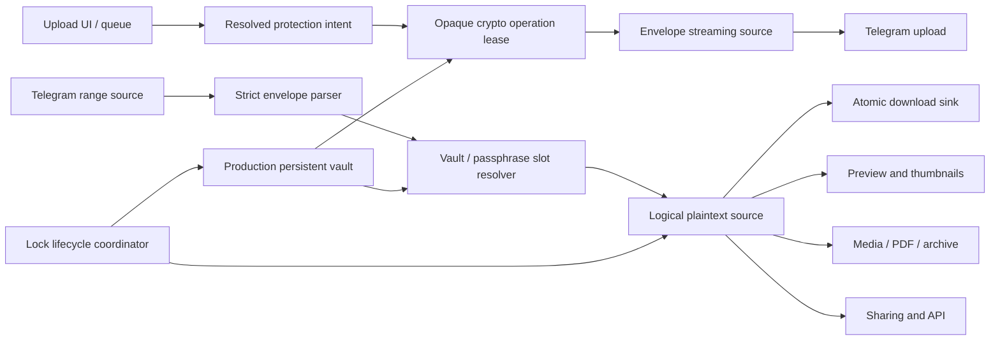

# Telegram Drive — Encryption Remediation and Completion Plan

**Document status:** implementation handoff  
**Created:** 2026-07-26  
**Scope:** the delta between the intended encryption design and the implementation described in DeepSeek's completion handoff  
**Supersedes:** completion claims in the DeepSeek handoff, but not the security/product requirements in [`ENCRYPTION_MODE_IMPLEMENTATION_PLAN.md`](./ENCRYPTION_MODE_IMPLEMENTATION_PLAN.md)  
**Audience:** DeepSeek V4 Pro, Gemini, Codex, or another implementation team working in this repository

---

## 1. Executive verdict

The current encryption work is an **unsafe prototype**, not a releasable encryption mode.

It contains useful scaffolding—the module layout, error taxonomy, some database fields, Tauri command registration, an initial settings surface, and an attempt at streaming encryption—but it does not yet satisfy the original architecture or the minimum conditions for protecting user data.

The most serious issue is not missing polish. The current envelope loses half of the random XChaCha20-Poly1305 key-wrapping nonce. A file encrypted by the current upload path cannot reliably unwrap its data-encryption key later. At the same time, production feature flags advertise encrypted upload and read as available, while the application constructs a test-only in-memory vault that disappears on restart. That combination creates a direct data-loss risk.

Accordingly:

1. Do not ship or expose encrypted file creation from the current code.
2. Do not reinterpret the current experimental `TDENC1` bytes as a corrected format.
3. Preserve and inventory any ciphertext already uploaded; do not delete it automatically.
4. Build a corrected, versioned envelope and production vault before re-enabling encryption.
5. Keep every ordinary plaintext path available and unchanged throughout remediation.
6. Treat “encryption off” as “new uploads default to plaintext,” not as an inability to read existing encrypted files.

The implementation sequence in this document is deliberately gated. No phase may claim completion merely because the code compiles.

---

## 2. Audit baseline

This plan was produced by comparing:

- the DeepSeek completion handoff;
- the original encryption plan;
- the current Rust and TypeScript source;
- the current database and Tauri command integration;
- focused build and validation results.

### 2.1 Validation results on 2026-07-26

| Check | Result | Meaning |
|---|---:|---|
| `npm run build` | Pass | TypeScript and Vite can produce a frontend bundle. This does not validate crypto behavior. |
| `cargo test` | **Fail** | Rust tests do not compile. `crypto/envelope/vectors.rs` has an unconstrained `Vec` at line 57. |
| `npm run i18n:check` | **Fail** | Localization is not release-ready. The check also exposes broader existing i18n debt. |
| Encryption locale audit | **Fail** | English contains 59 encryption keys; each of the other 12 production locales is missing 58 of them. |

The supported locale set presently audited is English plus Arabic, German, Spanish, French, Hindi, Indonesian, Japanese, Korean, Brazilian Portuguese, Russian, Turkish, and Simplified Chinese.

### 2.2 Completion claims versus repository evidence

| Claimed or implied area | Actual status | Required response |
|---|---|---|
| Envelope and crypto core complete | Stop-ship nonce, length, parser, authentication, and test defects remain | Replace the experimental format under a new version and add immutable vectors |
| Vault lifecycle complete | Production constructs `MemoryVault`; it is non-persistent and accepts any passphrase | Add a production persistent vault; compile MemoryVault only for tests/development |
| Recovery implemented | Export/import is a placeholder and the displayed recovery key is unrelated to encrypted files | Remove the false recovery promise and implement a real round-trip format |
| Encrypted upload/download integrated | Hard-coded session ID, incorrect content length, full-buffer download, cleanup gaps, and Android gaps remain | Rebuild on explicit operation handles and true streaming adapters |
| Settings UI complete | Loading and command failures are rendered as “not available”; many controls are not applied | Add a truthful state machine, backend handshake, and one settings source of truth |
| Per-file encryption implemented | Upload only recognizes vault mode; user-set per-file passphrases/keys are absent | Add explicit multi-slot protection intents and prompts |
| File UI integrated | Badge is unused and frontend/backend field shapes do not align | Normalize contracts and wire every file presentation |
| Feature preservation complete | Preview, streaming, archives, sharing, API, migration, search, and several operations bypass decryption | Introduce one logical plaintext source and migrate all consumers |
| Golden vectors complete | Test file is procedural, incomplete, and does not compile | Commit deterministic, externally inspectable known-answer vectors |
| Language support complete | 58 of 59 encryption strings are missing from every non-English locale | Complete translation, RTL, expansion, and accessibility gates |

---

## 3. Immediate containment — Phase 0

These tasks come before further feature work. Their purpose is to prevent the prototype from creating more unreadable data while retaining every plaintext feature.

### 3.1 Disable unsafe creation

- Set encrypted creation, migration, sharing, and encrypted upload flags to `false` in production builds.
- Do not base readiness on hard-coded booleans. Readiness must require:
  - the production vault backend;
  - the corrected envelope version;
  - passing crypto vectors;
  - registered backend commands whose version matches the frontend;
  - a supported platform.
- Permit the prototype only behind an explicit developer-only build flag and a separate test data directory.
- Keep plaintext upload, URL upload, folder ZIP upload, download, preview, streaming, archive, sharing, REST API, themes, advertisements, and all navigation behavior unchanged.

### 3.2 Quarantine experimental `TDENC1`

- Treat bytes written by the current implementation as `TDENC1-experimental`.
- Do not silently repair or reinterpret its 12-byte stored wrapping nonce as the corrected format.
- Corrected files must use a new magic/version, recommended as `TDENC2` / version `2`.
- On discovery of a `TDENC1` object, show `encrypted_unsupported_experimental` rather than `corrupt` or `wrong passphrase`.
- Provide a raw-ciphertext export action so users can preserve experimental objects for forensic recovery attempts.

### 3.3 Inventory possible affected data

Add a read-only diagnostic that reports, without secrets:

- count of local `encrypted_files` rows by format version;
- Telegram folder/message identifiers;
- header hash and ciphertext size;
- whether a local vault exists;
- whether a raw ciphertext export has been verified.

The diagnostic must not delete rows, remote messages, keys, caches, or files. If any current `TDENC1` object exists, freeze destructive crypto migrations and produce a user-visible recovery report.

### 3.4 Remove misleading recovery actions

Until real export/import round trips pass:

- hide or disable “generate recovery key,” “export recovery,” and “import recovery” in release builds;
- never display the current random string as if it can restore the vault;
- label any developer-only action as non-recoverable test scaffolding.

### 3.5 Fix the observed “not available in this build” diagnosis

The source currently initializes crypto flags as available. Therefore the existing message usually means one of these conditions:

- capabilities are still loading;
- the Tauri invocation failed;
- the frontend is running against an older/stale application process;
- the backend command set does not match the frontend bundle.

The UI currently collapses all four states into the same message and swallows the command error. Phase 0 must introduce distinct `loading`, `unavailable`, `blocked`, `ready`, and `error` states, include a retry button, and show a non-secret diagnostic build/command version. This will prevent a stale v1.9.9 process from masquerading as a feature decision.

### Phase 0 exit gate

- A release build cannot create experimental encrypted uploads.
- A developer build carries a persistent warning and isolated data path.
- Plaintext behavior passes its existing smoke suite.
- The settings screen never renders “not available” while capability loading is unresolved.
- Existing experimental ciphertext is preserved and discoverable.

---

## 4. Stop-ship defect register

Every P0 item must close before encrypted upload is re-enabled.

| ID | Severity | Gap | Repository evidence | Required remediation | Acceptance evidence |
|---|---|---|---|---|---|
| ENC-P0-001 | Critical | Key-wrap nonce is unrecoverable | `key_slot.rs` generates a 24-byte XNonce, stores 12 bytes, then reconstructs the missing 12 as zeros | Store the complete 24-byte nonce in the corrected slot format | Deterministic and randomized wrap/unwrap tests pass for all slot kinds |
| ENC-P0-002 | Critical | Test-only vault used in app setup | `lib.rs` constructs `MemoryVault` while production flags are enabled | Add a production persistent vault and make release builds refuse MemoryVault | Restart, logout, and upgrade tests retain authorized keys |
| ENC-P0-003 | Critical | Recovery is nonfunctional | Memory export returns a literal marker; import creates a new key; standalone export code exposes placeholder raw-key behavior | Specify and implement authenticated, encrypted recovery bundles | Export → destroy local vault → import → decrypt old file passes |
| ENC-P0-004 | Critical | Exact ciphertext size is wrong | Metadata tag is counted even when no metadata record exists; some call sites count metadata twice | Make one length function own the entire formula and compare emitted bytes to declared bytes | Boundaries 0, 1, chunk−1, chunk, chunk+1, and Telegram limit pass |
| ENC-P0-005 | Critical | Upload/download use session ID `1` | `commands/fs.rs` calls `get_wrapping_key(1)` in both paths | Resolve a current unlock session through an opaque operation lease, never a magic ID | Lock/reunlock and concurrent transfer tests pass |
| ENC-P0-006 | Critical | Header is not cryptographically bound to content | Current “commitment” is an unkeyed digest and is absent from slot/chunk AAD | Add a DEK-derived header authenticator and bind verified header identity to metadata, chunks, and final record | Header mutation tests fail closed before plaintext release |
| ENC-P0-007 | Critical | Parser is permissive | Truncated metadata can become empty; slot table shape and identifiers are not strictly validated; trailing bytes can be ignored | Reject truncation, overflow, unknown required algorithms, malformed slot counts, missing final record, and trailing bytes | Mutation/fuzz corpus passes without panic or partial success |
| ENC-P0-008 | Critical | Rust crypto test suite does not compile | `vectors.rs` line 57 leaves a `Vec` type unresolved | Replace unfinished procedural test with real fixtures and make all tests execute | Clean `cargo test` passes on every supported target |
| ENC-P0-009 | Critical | Full-buffer download can exhaust memory | Encrypted download collects ciphertext and plaintext into `Vec`s | Stream authenticated records into an atomic sink with bounded memory | Near-limit generated stream remains within documented memory budget |
| ENC-P0-010 | Critical | Settings can promise behavior backend does not apply | settings command returns defaults and update only logs; frontend settings are separate | Establish one canonical settings store and an acknowledged backend apply contract | Restart and live-update tests show identical UI/backend policy |

---

## 5. Corrected target architecture

The replacement should retain the modular intent of the original plan but narrow the number of paths where cryptography can occur.



### 5.1 Non-negotiable boundaries

- All cryptographic primitives remain in Rust.
- React handles choices and prompts, but never holds a long-lived master key or DEK.
- Telegram receives ciphertext only for encrypted objects.
- All consumers obtain bytes from `LogicalMediaSource`; they do not choose ad hoc between Telegram bytes and decrypted bytes.
- Plaintext files continue through the current fast path.
- The database is an index, not the only way to recognize an encrypted object.
- No secret, passphrase, recovery key, DEK, or plaintext content is written to application logs.
- No unauthenticated plaintext reaches a user-visible file, preview, media decoder, archive parser, or HTTP response.

### 5.2 Canonical protection intent

Use one discriminated contract from queue creation through Rust invocation:

```ts
type ProtectionIntent =
  | { mode: 'plain' }
  | { mode: 'vault'; protectMetadata: boolean }
  | { mode: 'passphrase'; protectMetadata: boolean; promptToken: string }
  | { mode: 'vault_and_passphrase'; protectMetadata: boolean; promptToken: string };
```

`promptToken` is a short-lived opaque handle. The passphrase itself must be submitted through a dedicated command, immediately consumed in Rust, zeroized where practical, and never persisted in the upload queue or settings file.

The app-wide on/off preference controls the default for **new uploads**. It must not disable decryption of already-encrypted files.

### 5.3 Capability handshake

Replace nullable capability booleans with a versioned response:

```ts
type EncryptionAvailability = 'disabled' | 'development' | 'blocked' | 'ready';

interface CryptoCapabilitiesV2 {
  contractVersion: 2;
  appVersion: string;
  backendBuildId: string;
  availability: EncryptionAvailability;
  blockers: string[];
  vaultBackend: 'stronghold' | 'test-memory' | 'none';
  readableFormats: number[];
  writableFormats: number[];
  features: {
    upload: boolean;
    read: boolean;
    perFilePassphrase: boolean;
    recovery: boolean;
    share: boolean;
    migration: boolean;
  };
}
```

The frontend must reject an unknown contract version and show the actual reason. It must never infer “not available” from `null`.

---

## 6. Phase 1 — Replace and freeze the envelope format

Do not patch the existing slot layout in place. Write a corrected ADR and implement a new format version.

### 6.1 ADR decisions that must be explicit

The new ADR must define, byte for byte:

- magic and version;
- endian order;
- fixed preamble layout;
- complete header length semantics;
- slot count and fixed/variable slot encoding;
- full 24-byte XChaCha20-Poly1305 key-wrap nonce;
- KDF identifiers and bounded parameter rules;
- encrypted metadata presence/absence and exact length;
- nonce construction for metadata, content records, and final record;
- domain-separated key derivation labels;
- AAD for every AEAD operation;
- keyed header authentication;
- chunk record layout;
- final record layout and its exact 68-byte ciphertext size if the 52-byte plaintext is retained;
- exact total ciphertext formula;
- zero-byte behavior;
- trailing-byte behavior;
- unknown-version and unknown-algorithm behavior;
- maximum header, metadata, slot, chunk, and total sizes.

### 6.2 Recommended corrected slot

If the current fixed fields are retained, the corrected slot is at least 104 bytes:

| Field | Bytes |
|---|---:|
| kind | 1 |
| slot ID | 1 |
| KDF ID | 2 |
| memory | 4 |
| iterations | 4 |
| parallelism | 4 |
| salt | 16 |
| XChaCha wrap nonce | **24** |
| wrapped DEK + tag | 48 |
| **Total** | **104** |

Do not substitute a 12-byte nonce while continuing to call the primitive XChaCha20-Poly1305.

### 6.3 Header authentication

Use HKDF-SHA-256 with domain-separated labels to derive content, metadata, and header-authentication subkeys from the DEK. The recommended sequence is:

1. Parse only enough bounded, untrusted fields to locate candidate slots.
2. Reject lengths and KDF parameters outside policy before allocation or KDF work.
3. Unwrap a DEK using a selected slot whose descriptor is AEAD AAD.
4. Verify a keyed header authenticator over the immutable preamble, complete slot table, and encrypted metadata.
5. Only then accept metadata or expose a content record.
6. Bind the verified header identity, file UUID, record type, record index, and declared plaintext length into record AAD.

An unkeyed SHA-256 digest may remain as a cache/index fingerprint, but it is not an authenticity mechanism.

### 6.4 Exact length ownership

Have exactly one canonical function calculate total size. Define whether `header_total_length` already includes encrypted metadata, then never add it twice.

Recommended formula:

```text
total_ciphertext = complete_header_length
                 + plaintext_length
                 + (chunk_count × 16)
                 + final_record_ciphertext_length
```

Here, `complete_header_length` includes the preamble, all slots, encrypted metadata when present, and the header authenticator. If metadata is absent, no phantom 16-byte tag is counted or emitted.

The streaming writer must count emitted bytes and assert equality with the declared upload length before success is reported.

### 6.5 Strict parsing rules

- Never clamp attacker-supplied KDF parameters. Reject them.
- Require slot count/table length consistency.
- Require at least one usable slot.
- Reject duplicate slot IDs unless the ADR explicitly permits them.
- Reject unsupported mandatory KDF/cipher identifiers.
- Reject header and integer overflows before allocation.
- Reject truncated metadata and records.
- Require exactly one final record.
- Reject records after the final record.
- Reject extra trailing bytes.
- Do not return any plaintext from a record whose tag has not verified.

### 6.6 Deterministic vectors

Commit fixture files, not only procedural round-trip tests:

- fixed keys, salts, UUIDs, nonces, passphrases, and KDF parameters for tests only;
- plaintext and full expected envelope bytes;
- decoded field manifest in JSON;
- cases for 0, 1, chunk−1, chunk, chunk+1, multi-chunk, metadata/no metadata, and every slot kind;
- wrong-key, wrong-passphrase, mutation, truncation, and trailing-byte cases.

Generate them once with a non-shipping vector tool, review them independently, and make changes require a new format version.

### Primary file scope

- `app/docs/adr/ADR-0001-encrypted-file-envelope.md` — mark superseded
- new `app/docs/adr/ADR-0002-encrypted-file-envelope-v2.md`
- `app/src-tauri/src/crypto/policy.rs`
- `app/src-tauri/src/crypto/envelope/*`
- `app/src-tauri/src/crypto/kdf.rs`
- `app/src-tauri/src/crypto/secret.rs`
- new immutable test fixtures under `app/src-tauri/tests/fixtures/encryption/`

### Phase 1 exit gate

- Every vector and mutation test passes.
- The parser fuzz target runs without panic, out-of-bounds allocation, or plaintext release.
- Emitted length equals declared length for every boundary case.
- An independent reviewer signs off on ADR/layout consistency.
- No upload integration is enabled yet.

---

## 7. Phase 2 — Production vault, recovery, and lifecycle

### 7.1 Production vault

Implement a durable `CryptoVault` backend using a reviewed platform-secure facility. Tauri Stronghold is a reasonable cross-platform starting point, subject to platform verification. The production binary must fail closed if it cannot initialize the configured secure vault.

Requirements:

- `MemoryVault` is available only under `cfg(test)` or an unmistakable developer feature.
- Vault creation is atomic and returns a real unlocked session.
- The user passphrase gates access; the backend must not accept every value.
- Wrong passphrase, missing vault, corrupt vault, and unsupported vault version are distinct stable errors.
- The vault master key is never stored in `settings.json`, SQLite, logs, recovery UI, or frontend state.
- A passphrase change re-protects the vault; it does not require re-encrypting every file.
- Secrets are zeroized on lock/drop where the language/runtime permits it.
- Predictable counters are replaced with random opaque session and operation handles.

### 7.2 Recovery bundle

Specify a versioned recovery bundle with:

- magic/version and KDF parameters;
- salt and nonce;
- vault identity and creation timestamp if useful;
- encrypted vault recovery material;
- authenticated metadata;
- checksum/fingerprint for user comparison, not as authentication;
- explicit forward-compatibility behavior.

The recovery passphrase must derive a wrapping key through bounded Argon2id. Import must decrypt the original vault recovery material, not create an unrelated random key.

Required destructive recovery test:

1. Create vault.
2. Encrypt multiple files using vault slots.
3. Export bundle.
4. Delete the test vault in an isolated temporary directory.
5. Import bundle with correct passphrase.
6. Decrypt all original files.
7. Confirm wrong passphrase and modified bundle fail without changing the existing vault.

### 7.3 Lock lifecycle

Create one `CryptoLifecycleCoordinator` that owns:

- auto-lock timeout;
- last authorized activity;
- app suspend/background events;
- logout/account switch;
- app exit;
- explicit lock;
- active leases;
- derived-key and plaintext cache invalidation.

Lock must revoke new operations immediately. Existing operations need a documented policy: recommended behavior is cancellation at the next authenticated-record boundary, deletion of partial plaintext, and a stable `VAULT_LOCKED` state that can resume only from a safe boundary.

Wire the coordinator to desktop sleep/wake and mobile background events. `check_auto_lock` must be driven by an actual timer/event loop rather than existing unused methods.

### 7.4 KDF resource protection

- Reject policy violations instead of clamping.
- Limit concurrent Argon2 work.
- Add unlock backoff without permanently denying legitimate users.
- Benchmark approved parameters on supported desktop and mobile hardware.
- Keep parameters stored with each relevant slot/bundle so future policy upgrades remain readable.

### Primary file scope

- `app/src-tauri/src/crypto/vault/*`
- `app/src-tauri/src/crypto/state.rs`
- `app/src-tauri/src/crypto/cache.rs`
- `app/src-tauri/src/crypto/lease.rs`
- `app/src-tauri/src/crypto_commands.rs`
- `app/src-tauri/src/lib.rs`
- `app/src-tauri/Cargo.toml`
- Tauri/mobile lifecycle integration files

### Phase 2 exit gate

- Restart and recovery tests decrypt old test files.
- Lock, timeout, background, logout, and exit clear all sessions and caches.
- Release builds cannot construct MemoryVault.
- No placeholder recovery command is reachable.
- The vault survives an application update and rejects a wrong passphrase.

---

## 8. Phase 3 — Settings, UI truth, and per-file modes

This phase directly addresses the incomplete settings implementation and the misleading availability message.

### 8.1 One settings source of truth

Keep non-secret user preferences in the existing `SettingsContext`/Tauri store, then apply them to Rust through one validated, acknowledged `cmd_apply_encryption_settings` contract. Remove the duplicate backend “defaults-only” settings illusion.

Rules:

- The frontend store owns durable, non-secret UI preferences.
- Rust owns current effective security state and may reject unsafe/unsupported values.
- On startup, the provider sends the complete settings object and waits for an acknowledgment containing effective settings.
- Uploads always pass an explicit resolved `ProtectionIntent`; Rust never guesses from a stale default.
- Auto-lock and temporary-plaintext policy are applied to the lifecycle/cache coordinators.
- Passphrases and recovery keys never enter the settings store.

### 8.2 Correct provider state machine

Refactor `useEncryption.tsx` to expose:

- capability state: idle/loading/ready/blocked/error;
- capability error code and retry;
- vault state: absent/creating/locked/unlocking/unlocked/locking/error;
- current session only as a boolean/expiry description, not a reusable numeric secret;
- effective settings returned by Rust;
- event listeners for lock, expiry, background, recovery import, and backend restart;
- build/command version diagnostics.

Never swallow capability or vault-status errors. Map them to localized, actionable messages while retaining a copyable non-secret diagnostic code.

### 8.3 Settings information architecture

Desktop and mobile settings must provide the same capabilities:

1. **Default for new uploads** — Plaintext or Encrypted.
2. **Metadata privacy** — protect original name/type when encrypted.
3. **Vault status** — create, unlock, lock, and last authorized activity.
4. **Auto-lock** — validated timeout plus lock on sleep/background/logout.
5. **Per-file keys** — allow an upload-time passphrase in addition to or instead of the vault slot.
6. **Recovery** — shown only after a real recovery implementation passes.
7. **Temporary plaintext** — strict versus balanced policy with an honest explanation.
8. **Diagnostics** — format version, vault backend, build ID, and blockers; never secrets.

Use the application's semantic design tokens so default, light, dark, and custom themes continue to work. Do not introduce a separate hard-coded `telegram-*` color system if it bypasses the current theme engine.

#### Required key-loss and safe-use notice

The encryption section must always display a concise notice near the vault and recovery controls. Recommended user-facing copy:

> **Keep your encryption credentials safe**  
> Telegram Drive cannot recover or reset forgotten passphrases, encryption keys, or recovery material. If you lose every credential that can unlock a file, that file may become permanently inaccessible. Store recovery material securely, keep a verified backup, and never share credentials with anyone you do not trust.

Before vault creation, the first passphrase-only upload, removal of the last recovery method, or another action that could leave the user with a single point of key loss, require an explicit acknowledgment with the following expanded disclosure:

> By continuing, you acknowledge that you are responsible for safeguarding your encryption passphrases, keys, and recovery material. Telegram Drive cannot restore credentials it does not possess. To the extent permitted by applicable law, Telegram Drive is not responsible for data loss or unauthorized access caused by forgotten, lost, disclosed, or improperly stored encryption credentials.

Implementation requirements:

- Do not preselect the acknowledgment checkbox.
- Do not require repeated acknowledgment for routine uploads after the relevant risk has already been accepted, unless the recovery configuration materially changes.
- Clearly show how many independent unlock/recovery methods a file or vault will have before the user proceeds.
- Warn again before removing the final vault, passphrase, or recovery slot from an encrypted file.
- Link to a localized “Encryption and recovery” help page explaining key storage, recovery testing, sharing, and loss scenarios.
- Avoid claims such as “zero knowledge,” “impossible to lose,” or “fully secure” unless independently verified and legally approved.
- Treat this as a credential-custody warning, not a disclaimer for application defects, corrupted output, broken migrations, or other failures caused by the software.
- Have final liability language reviewed by qualified counsel for each release jurisdiction. Product copy must not attempt to waive non-waivable consumer rights.
- Add localized keys for the notice title/body, expanded disclosure, acknowledgment, recovery-method warning, and help link in every supported locale.

### 8.4 Upload-time behavior

Update queue creation and processing so every source resolves protection once:

- local single/multi-file upload;
- drag and drop;
- folder ZIP upload;
- remote URL upload;
- retry/resume;
- mobile share/import intent if supported.

An encrypted queue item that needs a vault or passphrase must enter `waiting_for_unlock`, not fail or silently fall back to plaintext. Queue persistence may store the protection mode but never the passphrase or operation handle.

Per-file choices:

- Use vault key.
- Use a file passphrase.
- Use both vault and file passphrase slots.
- Generate an optional high-entropy recovery key/key file after the implementation exists.

The UI must explain that a lost passphrase/key is unrecoverable when no other valid slot exists.

### 8.5 File presentation

- Normalize Rust/TypeScript fields to one `FileEncryptionInfo` shape.
- Attach encryption state to list/grid data.
- Use `EncryptionBadge` in desktop cards, list rows, mobile rows, detail/preview headers, context menus, and share dialogs where relevant.
- Localize every label and tooltip.
- Preserve compact card sizing and long-name layout fixes.
- Do not make encryption status depend solely on the local registry; support `unknown/checking`.

### Primary file scope

- `app/src/hooks/useEncryption.tsx`
- `app/src/components/shared/EncryptionSettingsSection.tsx`
- `app/src/components/shared/EncryptionBadge.tsx`
- `app/src/context/SettingsContext.tsx`
- `app/src/hooks/useFileUpload.ts`
- `app/src/types.ts`
- desktop/mobile file and settings components
- `app/src-tauri/src/crypto_commands.rs`
- `app/src-tauri/src/commands/fs.rs`

### Phase 3 exit gate

- A current backend never shows the stale-build message.
- A stale backend is identified by contract/build mismatch.
- Every upload origin passes an explicit protection intent.
- Turning encryption off makes future uploads plaintext while existing encrypted files remain readable.
- Per-file vault/passphrase/both modes work end to end in isolated tests.
- Default, light, dark, and custom themes render the settings and badges correctly.

---

## 9. Phase 4 — Safe streaming upload and download

### 9.1 Upload

Replace the hard-coded `get_wrapping_key(1)` calls with a scoped crypto operation lease acquired from the resolved protection intent.

The upload adapter must:

- read the source incrementally;
- emit header, authenticated metadata, encrypted chunks, and final record;
- expose an exact content length before Telegram upload starts;
- report plaintext-relative progress consistently;
- support cancellation between bounded chunks;
- release bandwidth reservations and operation leases on every return/error path;
- never write a plaintext staging copy solely for encryption;
- insert/reconcile the registry only after Telegram returns a message identity;
- leave a recoverable reconciliation record if Telegram succeeds but SQLite fails.

Use RAII guards for bandwidth reservations, temp objects, leases, and partial registry state. Manual release calls scattered across error paths are not sufficient.

### 9.2 Download/export

Implement an authenticated streaming sink:

1. Download and strictly parse the bounded header.
2. Resolve a slot and verify the keyed header authenticator.
3. Stream one ciphertext record at a time.
4. Verify the record tag before writing that record's plaintext.
5. Validate the final record and exact byte count.
6. Flush and sync the partial file as appropriate.
7. Atomically rename/publish only after complete verification.
8. Delete partial plaintext on cancellation, lock, corruption, or I/O failure.

Memory use must be `O(chunk size)`, not `O(file size)`.

On Android, successful verified plaintext must continue through the existing MediaStore/publish flow. A return from the encrypted branch must not strand the file in an app cache directory.

### 9.3 Registry consistency

- Run encryption migrations in explicit transactions.
- Use an unambiguous schema version and do not ignore migration errors.
- Persist format version, file UUID, header hash/fingerprint, mode, metadata policy, remote identity, and verification state.
- Never persist a user passphrase or raw DEK.
- Centralize insert/update/delete/move/copy behavior.
- Add reconciliation for missing rows, remote upload success/local failure, and stale rows.
- Detect envelope magic by bounded header range read when registry state is absent or suspect.

### Phase 4 exit gate

- Files from 0 bytes through a generated near-Telegram-limit stream round-trip with bounded memory.
- Cancel, network loss, disk-full, SQLite failure, lock, and app-restart injection tests leave no visible partial plaintext.
- All bandwidth reservations and leases return to zero.
- Android and desktop downloads land in the same user-visible destinations as plaintext downloads.
- Plaintext upload/download performance remains within the agreed regression budget.

---

## 10. Phase 5 — One logical plaintext source for every consumer

The current `LogicalMediaSource` abstraction is only scaffolding. It must become the mandatory read boundary.

### 10.1 Required implementations

- `PlaintextTelegramSource` — current direct Telegram range behavior.
- `EncryptedTelegramSource` — verified header, record mapping, slot resolution, bounded decrypted chunk cache.
- A factory that selects a source using registry plus envelope probing.

The factory returns logical filename, MIME type, plaintext length, range capability, encryption state, and stable errors.

### 10.2 Consumers to migrate

No consumer may call raw Telegram media bytes directly after this phase:

- image preview and the image-loading optimization path;
- thumbnail generation and thumbnail cache;
- PDF viewer;
- original media playback;
- adaptive/HLS/fMP4 streaming;
- video metadata probing;
- FFmpeg/transcode input;
- archive listing and extraction;
- download/export;
- desktop and mobile sharing;
- local server media routes;
- REST API file, range, thumbnail, archive, and bulk-download routes.

### 10.3 Caches and leases

- Cache keys include file UUID, header hash/version, chunk index, and logical transformation.
- Do not reuse a plaintext cache entry after rekey, content replacement, account switch, or lock.
- Strict mode keeps verified plaintext in memory where possible.
- Balanced mode may use an app-private, access-restricted cache with TTL, quotas, deletion on lock/logout, and clear UI disclosure.
- Never write decrypted bytes into the existing shared streaming cache without the plaintext cache policy.
- Cache cleanup is best-effort privacy hygiene, not a promise of forensic secure erasure on SSDs.

### 10.4 Range semantics

Map logical plaintext ranges to complete authenticated ciphertext records. Decrypt full records, then return only the requested subrange. Verify header identity before using cached mappings.

### Phase 5 exit gate

- Every listed consumer is covered by an encrypted/plaintext parity test.
- No direct raw-byte bypass remains outside the logical-source module and envelope-probing code.
- Lock invalidates encrypted logical sources and plaintext-derived caches.
- Image previews and media startup remain responsive under the documented cache/memory budgets.

---

## 11. Phase 6 — File operations, metadata, sharing, API, and migration

### 11.1 Encrypted metadata

The current upload uses opaque names but does not provide working encrypted original metadata. Implement and authenticate a metadata object containing at minimum:

- original filename;
- MIME type;
- logical modification timestamp if needed;
- optional original relative path for folder uploads;
- schema version.

Do not set `metadata_protected: true` unless that object exists, decrypts, and authenticates.

When locked, show a neutral encrypted placeholder. When unlocked, populate an in-memory logical index for name sorting, filtering, and search. Do not silently write decrypted names into ordinary persistent indices when metadata protection is enabled.

### 11.2 Move, copy, delete, rename, and duplicate handling

Define and test registry behavior for each operation:

- **Move:** preserve envelope and key slots; update remote identity/folder mapping transactionally.
- **Copy:** preserve or intentionally regenerate file UUID/DEK according to ADR; duplicate registry only after remote success.
- **Delete:** remove local registry/cache only after remote deletion succeeds; support reconciliation.
- **Rename:** write a dedicated product ADR because Telegram media bytes are immutable. Choose either re-upload, an encrypted companion manifest, or an explicitly local alias; do not pretend remote encrypted metadata changed when it did not.
- **Duplicate detection:** compare safe logical identifiers without exposing protected names/content hashes unnecessarily.

### 11.3 Sharing

Offer explicit choices:

- share original ciphertext;
- decrypt and export/share plaintext after confirmation;
- create an encrypted share package with a separate secret-delivery flow.

Never embed passphrases or recovery keys in the same share link/message as ciphertext. Existing plaintext sharing must remain unchanged.

### 11.4 REST and local server

- Existing plaintext endpoints remain compatible.
- Encrypted content is not served as plaintext until an authorized, time-limited lease exists.
- Range responses operate on logical plaintext ranges.
- API errors distinguish locked, key missing, corrupt, unsupported version, and policy rejection without leaking secrets.
- CORS/token behavior is preserved.
- Bulk ZIP creation streams logical plaintext and respects temp policy.

### 11.5 Migration and rekey

Implement only after all consumers use the logical source:

- plaintext → encrypted migration as copy/verify/commit/delete, never in-place destruction;
- encrypted → plaintext export with explicit confirmation;
- vault-slot addition/removal and passphrase-slot addition/removal without re-encrypting content when the format permits;
- passphrase change by rewrapping the DEK slot;
- master-vault rotation by rewrapping vault slots;
- full content re-encryption only for cipher/format migration.

Every migration must be resumable, idempotent, and verify the destination before offering deletion of the source.

### Phase 6 exit gate

- Operation and registry tests pass for plain and encrypted objects.
- Metadata-protected objects do not leak original names when locked.
- Share/API/archive flows have explicit encrypted semantics.
- Migration failure never destroys the only valid copy.

---

## 12. Phase 7 — Localization, accessibility, themes, mobile, and product parity

### 12.1 Language completion

There are currently 59 English encryption keys and 58 are missing from every other production locale. Close that gap using the repository's dedicated language plan and validation scripts.

Requirements:

- Translate all encryption settings, states, prompts, errors, warnings, recovery explanations, and action labels into all 13 supported locales.
- Define a glossary for “vault,” “passphrase,” “recovery key,” “encrypted metadata,” “lock,” “corrupt,” and “unsupported version.”
- Do not copy English into non-English locale files as a completion shortcut.
- Test Arabic RTL layout, mixed-direction filenames/key fingerprints, and icon direction.
- Test long German/Russian strings, CJK line breaking, and mobile narrow widths.
- Use locale-aware dates, durations, byte sizes, and plural forms.
- Ensure backend error codes are stable and frontend messages are localized; never localize by matching Rust error text.
- Translate and legally review the key-loss/safe-use notice and acknowledgment without weakening its meaning or overstating what the application can guarantee.
- Make `npm run i18n:check` a required CI gate.

### 12.2 Accessibility

- Full keyboard access for create/unlock/lock/recovery/per-file dialogs.
- Visible focus and no focus loss on lock events.
- Screen-reader announcements for unlocking, waiting, verifying, corruption, completion, and auto-lock.
- Never communicate encrypted/corrupt/locked state by color alone.
- Respect reduced motion.
- Preserve user zoom and compact-density behavior.

### 12.3 Themes and visual integration

- Default, light, dark, and custom themes remain supported.
- Encryption controls use semantic tokens from the app theme engine.
- Validate contrast for badge, warning, disabled, destructive, and success states.
- Preserve the quiet-utility density, card resizing, toolbar alignment, sidebar bounds, and settings transition updates already made.

### 12.4 Mobile parity

- Add encryption settings to the mobile settings surface.
- Handle mobile background auto-lock and foreground resume.
- Preserve Android foreground upload service behavior.
- Publish verified downloads through MediaStore.
- Test biometric-assisted vault unlock only as a wrapper around the production vault, never as a replacement for recovery.

### 12.5 Unrelated feature parity

Regression-test and preserve:

- advertisements and ad placement;
- Telegram authentication and logout;
- sync actions;
- bandwidth controls;
- folder navigation and initial-load deduplication;
- upload/download queues;
- themes and custom theme editor;
- preview performance;
- desktop/mobile responsive layouts.

### Phase 7 exit gate

- All locale validation passes.
- Accessibility smoke tests and manual RTL/expansion reviews pass.
- Theme snapshots pass for default/light/dark/custom modes.
- Ad, authentication, folder, transfer, and settings parity tests pass.

---

## 13. Phase 8 — Hardening, audit, and staged rollout

### 13.1 Security hardening

- Run dependency audit and license review.
- Fuzz header parser, range mapper, metadata parser, and recovery bundle parser.
- Add property tests for length, range, nonce uniqueness, slot mutations, and streaming chunk boundaries.
- Review secret lifetimes and logging.
- Review temporary-file permissions and platform backup behavior.
- Verify no plaintext enters crash reports, logs, analytics, thumbnails, OS recent-file lists, or ad/browser storage through the crypto paths.
- Commission independent cryptographic design/code review before general availability.

### 13.2 Rollout stages

1. **Internal fixture-only:** write enabled only against isolated test Telegram data.
2. **Developer alpha:** explicit build flag, prominent warning, raw ciphertext export, telemetry limited to non-secret failure codes.
3. **Opt-in beta:** production vault and all phase gates complete; plaintext remains default.
4. **General availability:** independent review complete, recovery drill complete, and rollback/export documentation published.
5. **Optional default encrypted:** only after a separate product decision supported by reliability data; never silently change existing users' upload default.

### 13.3 Rollback

Feature flags may stop new encrypted uploads without removing the ability to:

- recognize encrypted files;
- unlock the vault;
- decrypt/export supported formats;
- export raw ciphertext;
- read recovery documentation.

Rollback must never strand already-created ciphertext behind a hidden settings page.

### Phase 8 exit gate

- Independent audit has no unresolved critical/high issue.
- Recovery drill passes on every supported desktop/mobile platform.
- Rollback rehearsal preserves encrypted read/export.
- Support documentation explains keys, loss scenarios, metadata exposure, sharing, and backups accurately.

---

## 14. Detailed missing-feature register

The following work was absent or incomplete in the handed-off implementation. This register should be tracked in issues using the stable IDs.

| ID | Priority | Area | Missing or incomplete behavior |
|---|---:|---|---|
| ENC-101 | P0 | Format | Full XChaCha key-wrap nonce storage |
| ENC-102 | P0 | Format | Consistent fixed sizes and exact-length formula |
| ENC-103 | P0 | Format | Keyed header authentication and record binding |
| ENC-104 | P0 | Parser | Strict truncation, trailing-byte, slot, algorithm, and overflow rejection |
| ENC-105 | P0 | KDF | Reject hostile parameters; concurrency/backoff policy |
| ENC-106 | P0 | Tests | Compiling immutable known-answer vectors |
| ENC-107 | P0 | Vault | Persistent release vault |
| ENC-108 | P0 | Recovery | Real authenticated export/import round trip |
| ENC-109 | P0 | State | Random operation/session handles; no hard-coded ID |
| ENC-110 | P0 | Transfer | Bounded-memory authenticated download sink |
| ENC-111 | P0 | Transfer | RAII cleanup of bandwidth, leases, temp state, and partial files |
| ENC-112 | P0 | UI | Loading/error/stale-build states separated from unsupported state |
| ENC-201 | P1 | Settings | Canonical persisted preferences and acknowledged backend policy |
| ENC-202 | P1 | Lifecycle | Working timeout, sleep/background, logout, and exit lock |
| ENC-203 | P1 | Upload | Protection intent passed by all upload origins |
| ENC-204 | P1 | Per-file keys | Passphrase and vault+passphrase slot modes |
| ENC-205 | P1 | Metadata | Authenticated encrypted name/MIME payload |
| ENC-206 | P1 | Registry | Transactional migrations and reconciliation |
| ENC-207 | P1 | Identity | Envelope probing when registry is missing/stale |
| ENC-208 | P1 | UI | Badges and normalized encryption state on all file views |
| ENC-209 | P1 | Mobile | Settings, background lock, upload service, MediaStore publishing |
| ENC-210 | P1 | i18n | 58 missing encryption strings in 12 locales |
| ENC-301 | P2 | Preview | Image/thumbnail logical source and protected cache |
| ENC-302 | P2 | Media | Original/range/HLS/fMP4/transcode decryption path |
| ENC-303 | P2 | PDF | Logical-source PDF reads |
| ENC-304 | P2 | Archives | Logical-source listing/extraction and bulk ZIP |
| ENC-305 | P2 | Sharing | Ciphertext/plaintext/encrypted-package choices |
| ENC-306 | P2 | REST/server | Authorized logical plaintext and range responses |
| ENC-307 | P2 | Operations | Move/copy/delete/rename/duplicate registry semantics |
| ENC-308 | P2 | Search | In-memory decrypted metadata index |
| ENC-309 | P2 | Migration | Resumable plaintext↔encrypted workflows |
| ENC-310 | P2 | Rekey | Add/remove/re-wrap key slots without content rewrite |
| ENC-401 | P3 | Cache | Lease-aware memory/private-disk policy and cleanup |
| ENC-402 | P3 | Fuzzing | Parser, bundle, metadata, and range fuzz targets |
| ENC-403 | P3 | Audit | Independent cryptographic review |
| ENC-404 | P3 | Rollout | Read/export-preserving kill switch and staged release |

---

## 15. Test and CI matrix

### 15.1 Rust unit/known-answer tests

- Envelope encode/decode for every size boundary and slot mode.
- Key wrap/unwrap with full nonce.
- KDF approved/rejected parameters.
- Exact length checked against actual bytes emitted.
- Header, slot, metadata, chunk, final record, truncation, and trailing mutation.
- Wrong vault, wrong passphrase, missing key, corrupt data, unsupported version.
- Recovery export/import and vault passphrase change.
- Range mapping for first/middle/last/partial chunks.
- Zeroization/drop behavior where observable.

### 15.2 Integration tests

| Dimension | Required cases |
|---|---|
| Protection | plain, vault, passphrase, vault+passphrase |
| Metadata | protected, compatibility/plain |
| Size | 0, 1, chunk−1, chunk, chunk+1, multi-chunk, near limit |
| State | vault absent, locked, unlocked, auto-locked, recovery-imported |
| Transfer | success, cancel, retry, disconnect, bandwidth limit, disk full |
| Data state | recognized, registry missing, stale registry, corrupt, unsupported |
| Consumer | download, image, thumbnail, PDF, media, transcode, archive, share, API |
| Platform | macOS, Windows, Linux, Android and other declared supported mobile targets |
| Theme | default, light, dark, representative custom theme |
| Locale | all 13; focused RTL, long-string, and CJK cases |

### 15.3 Failure injection

Inject failure:

- after header creation;
- mid chunk;
- immediately before final record;
- after Telegram upload but before DB insert;
- after DB staging but before commit;
- during vault write/import;
- during partial-file flush/rename;
- on lock/background during every consumer;
- after cache creation and before lease registration.

For each failure assert remote/local state, partial plaintext cleanup, lease counts, bandwidth reservations, registry reconciliation, and safe retry behavior.

### 15.4 Required CI gates

At minimum:

```bash
cd app/src-tauri
cargo fmt --check
cargo test
cargo clippy --all-targets --all-features -- -D warnings

cd app
npm run build
npm run i18n:check
```

Add dedicated vector, fuzz-smoke, dependency-audit, theme snapshot, and platform integration jobs. If the wider repository has pre-existing warnings, baseline them explicitly; do not suppress new crypto warnings.

---

## 16. Performance and resource budgets

Set measurable budgets before release:

- encryption/decryption memory: bounded by a small multiple of chunk size;
- no full-file `Vec` for upload, download, preview, archive, or share;
- maximum concurrent Argon2 jobs: platform-profiled and bounded;
- exact upload-length calculation: constant time in file size;
- random access: only necessary authenticated chunks fetched;
- cache size/TTL: configurable and enforced;
- plaintext fast path: no crypto allocation or vault dependency;
- preview startup: retain the recently improved image-loading behavior through decrypted chunk caching;
- UI: capability/settings load cannot block ordinary file browsing.

Record benchmark results for representative 1 MB, 100 MB, 1 GB, and near-limit generated streams on each supported class of hardware.

---

## 17. Definition of done

Encryption is complete only when all statements below are true:

- [ ] Release builds use a production persistent vault.
- [ ] Corrected format ADR and immutable vectors are reviewed and passing.
- [ ] No current format stores a partial AEAD nonce.
- [ ] Exact Telegram content length equals bytes emitted at all boundaries.
- [ ] Upload and download use bounded memory.
- [ ] No unauthenticated plaintext reaches disk or a consumer.
- [ ] Recovery restores access to files after deletion of an isolated test vault.
- [ ] Per-file vault, passphrase, and combined modes work.
- [ ] Encryption can be selected or disabled by the end user without affecting existing encrypted reads.
- [ ] All upload origins preserve their chosen protection mode through retry.
- [ ] Preview, media, PDF, archive, share, and API use the logical source.
- [ ] Move, copy, delete, rename, search, and registry reconciliation have documented behavior.
- [ ] Auto-lock works on timeout, sleep/background, logout, and exit.
- [ ] Settings display accurate loading/error/blocker/build state.
- [ ] The encryption settings and high-risk key-management actions display the localized key-loss/safe-use notice and require acknowledgment where specified.
- [ ] Desktop and mobile settings have functional parity.
- [ ] All 13 locales pass validation and manual risk-focused review.
- [ ] Default, light, dark, and custom themes pass.
- [ ] Advertisements and all unrelated app features pass regression testing.
- [ ] `cargo test`, frontend build, i18n, platform integration, and security CI gates pass.
- [ ] Independent review has no unresolved high/critical finding.
- [ ] Stopping new encrypted uploads does not remove read/export/recovery access.

---

## 18. Execution instructions for the next implementer

1. Begin with Phase 0 containment and commit it separately.
2. Do not upload another encrypted object until Phases 1–4 have passed their gates in an isolated test account.
3. Do not edit or reinterpret experimental `TDENC1` ciphertext in place.
4. Preserve the plaintext path; encryption must be additive.
5. Keep commits small and aligned with the stable gap IDs.
6. Add tests before or with each behavior change.
7. Do not claim “golden vectors” unless committed expected bytes are actually asserted.
8. Do not claim “recovery” unless destroying the test vault and restoring old files passes.
9. Do not report feature completion based on `cargo check` or frontend compilation alone.
10. Do not suppress errors from capability, settings, registry, or crypto operations.
11. Never log secrets or persist passphrases in queues/settings.
12. Stop and update the ADR if any byte-layout ambiguity appears.
13. At the end of each phase, attach exact command output and a completed exit-gate checklist.
14. Avoid broad rewrites of the existing redesign, language system, ads, transfer UI, or theme engine.

Recommended implementation order:

```text
Containment
  → corrected format + vectors
  → production vault + real recovery
  → truthful settings + protection intent
  → safe upload/download
  → logical media source
  → operations/share/API/migration
  → full language/mobile/theme parity
  → audit and staged rollout
```

Work that may proceed in parallel after the corrected format contract is frozen:

- production vault backend;
- frontend capability/settings state machine;
- locale translation and accessibility review;
- plaintext regression harness.

Transfer, preview, archive, share, and migration integration must wait for the envelope and logical-source contracts they depend on.

---

## 19. Primary technical references

- [Telegram MTProto security overview](https://core.telegram.org/mtproto)
- [Telegram end-to-end encryption/Secret Chats distinction](https://core.telegram.org/api/end-to-end)
- [RFC 9106 — Argon2 Memory-Hard Function](https://www.rfc-editor.org/rfc/rfc9106.html)
- [RFC 5869 — HKDF](https://www.rfc-editor.org/rfc/rfc5869.html)
- [RustCrypto `chacha20poly1305` documentation](https://docs.rs/chacha20poly1305/latest/chacha20poly1305/)
- [libsodium secretstream and large-file encryption guidance](https://doc.libsodium.org/secret-key_cryptography/secretstream)
- [Tauri Stronghold plugin documentation](https://v2.tauri.app/plugin/stronghold/)
- [NIST SP 800-57 Part 1 Rev. 5 — Key Management](https://csrc.nist.gov/pubs/sp/800/57/pt1/r5/final)
- [NIST SP 800-88 Rev. 2 — Media Sanitization](https://csrc.nist.gov/pubs/sp/800/88/r2/final)

These references inform primitive use, password derivation, key lifecycle, Telegram's cloud-storage threat boundary, and realistic statements about deletion. They do not replace an application-specific format ADR or independent review.
